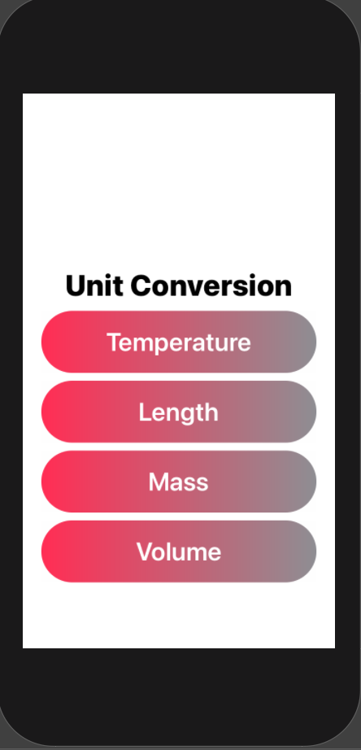
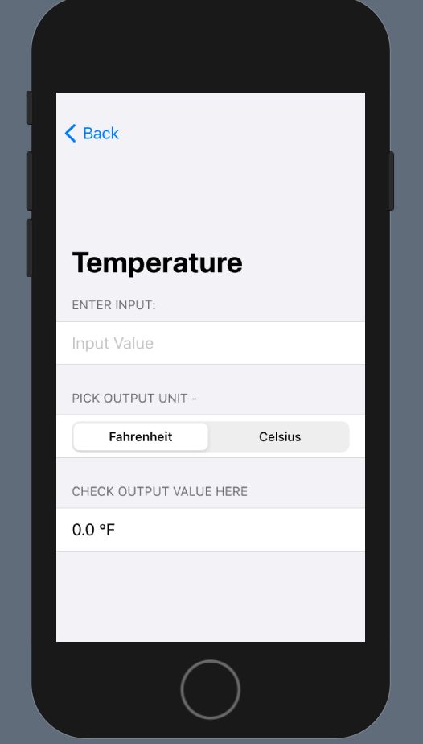
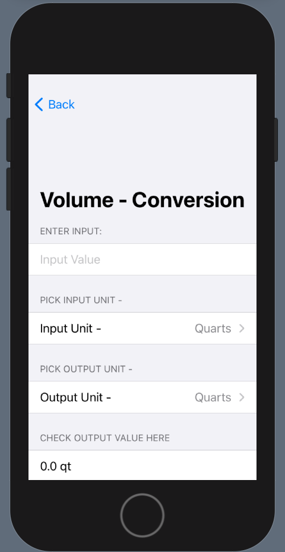

# Swift - Unit Convertsion Application
# About
- Simple Unit Conversion App that allows conversion of Temperature, Mass, Length,  and Volume Units
- Created Human Computer Interaction Course WSU_CSC_3400. 
- Developer: Fahmida Chowdhury

### The Look
     
 

# Own Personal Future Plans
- Check for errors in calculations and fix errors depending on error

 
 
 
